# Плагин для Unity, являющийся частю системы "удаленное управление проектами в Unity"

[](https://github.com/RealityFamily/StateControll_MobileAndroid/releases/tag/0.1.0)

## Установка

 ### Вариант 1

 Склонируйте этот репозиторий в папку `Packages`. 

 Для тех, кто захочет что-нибудь менять в плагине, можно добавить его в `Packages` как **git submodule**, однако все изменения необходимо отправлять при помощи **Pull-Request**.
 
 ### Вариант 2
 
 Откройте файл `Packages/manifest.json` и вставьте в него следующую стоку:
 ```
 {
    "dependencies": {
        "ru.realityfamily.statecontrol": "https://github.com/RealityFamily/StateControl_Unity.git",
        ...
    }
 }
 ```
 После этого сохраните файл и откроейте снова Unity.
 
 ### Вариант 3
 
 Скачайте последнюю версию сборки [отсюда](https://github.com/RealityFamily/StateControl_Unity/releases) и проследуйте инструкции по установке прилагаемой к ней.

## Терминология
 **Состояние** - это некое положение, в которое можно поместить проект. 
 
 > Например рассмотрим вариант использования в игре. <br/>Состояние *"Выбор сложности"* - поместит пользователя в состояния выбора уровня сложности. <br/> Cостояние *"Начало игры"* - поместит пользователя в игровую зону и запустит игровую логику.<br/> Cостояние *"Финиш"* - поместит пользователя перед доской рейтинга, где следующий пользователь перезапустит игру или администратор нажмет на *"Выбор сложности"*.

 **Упаковка и отправка** - это действие системы по преобразованию введенных разработчиком данных в JSON формат и отправке этих данных на сервер по адресу, предоставленному разработчиком.

## Интерфейс
 
 > 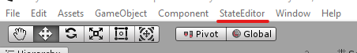 <br/>После установки сверху должен появиться пункт меню **State Editor**, если вдруг его там нет, то проверьте правильность установки.

 **Отркыть окно редактора состояний** открывает окно, в котором происходит основное изменение состояний приложения.<br/> 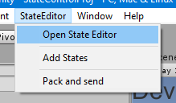
 
 >Однако, редактор доступ только в том случае, если на сцене уже есть объект состояний. Система сразу оповестит вас об этом и поскажет, как его добавить.<br/> 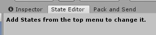 

 **Добавление объекта состояний** добавляет на сцену объект, хранящий в себе всю нужную для работы плагина информацию и все состояния приложения.<br/>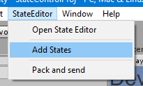

 >Если объект уже находится на сцене, то плаги предупредит об этом.<br/>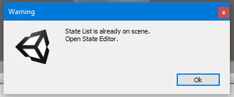

 **Упаковка и отправка** открывает окно с информацией, хранящейся на сервере, и внесенные в плагин состояния. <br/> 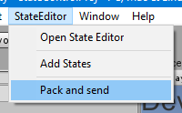 

## Использование
 Для использования плагина не нужно прикладывать много усилий.

 1. Нужно добавить на сцену объект состояний. **State Editor -> Add States**<br/> 
 2. Нужно открыть редактор состояний. **State Editor -> Open State Editor**<br/> 
 3. Ввести название приложения, которое потом отобразится в [пульте управления состояниями](https://github.com/RealityFamily/StateControll_MobileAndroid).<br/> 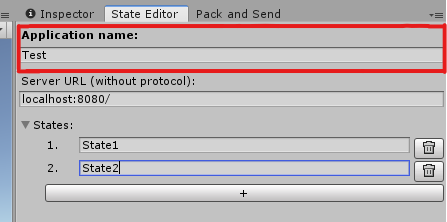
 4. Ввести URL доступа к серверу.<br/> `<URL сервера>`<br/>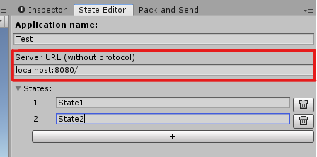 
 >URL сервера не должен в себе содержать протокол подключения и должен оканчиваться слешом **"/"**.
 5. Развернуть перечень состояний и заполнить.<br/> Чтобы добавить состояние, нужно нажать на кнопку с символом "+". а для того, чтобы его удалить, нужно нажать на кнопку с иконкой ведра.<br/> 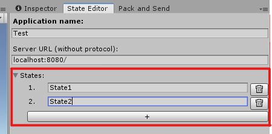
 > Запрещено вводить два состояния с одинаковым названием. Плагин данные действие не дает произвети с соответствующим сообщением.<br/>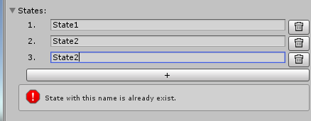
 6. Для подключения к состояниям действия необходимо сначала получить ссылку на объект состояний. Её можно полчить поиском объекта по тегу `States`.<br/> 
 ```
 private WebConnection _states = GameObject.FindGameObjectWithTag("States").GetComponent<WebConnection>();
 ```
 7. После чего можно производить само подключение. <br/>
 Важно помнить, что подключаемые методы не должны иметь входящих переметров и не могут ничего выводить.
 ```
 _states.ConnectToDelegate("State1", () => { Debug.Log("Called State1"); });
 ```
 8. После того, как все необходимые состояния были добавлены в редакторе, открываем "Упаковка и отправка"<br/>
 
 9. Проверяем что все данные считаны плагином корректно и можем отправлять состояния на сервер.<br/>
 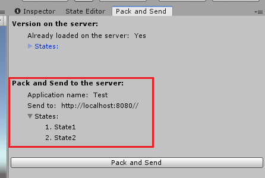 
 > Если данные, считанные плагином, совпадут с данными, хранящимися на сервере, плагин оповистит об этом и не даст их отправить.<br/>
 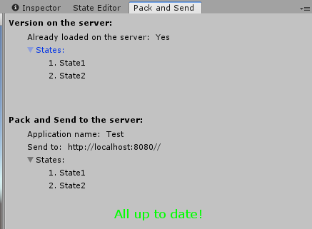


Если возникли какие-либо сложности в использовании данного плагина, вы всегда можете написать об этом [сюда](https://github.com/RealityFamily/StateControl_Unity/issues).
